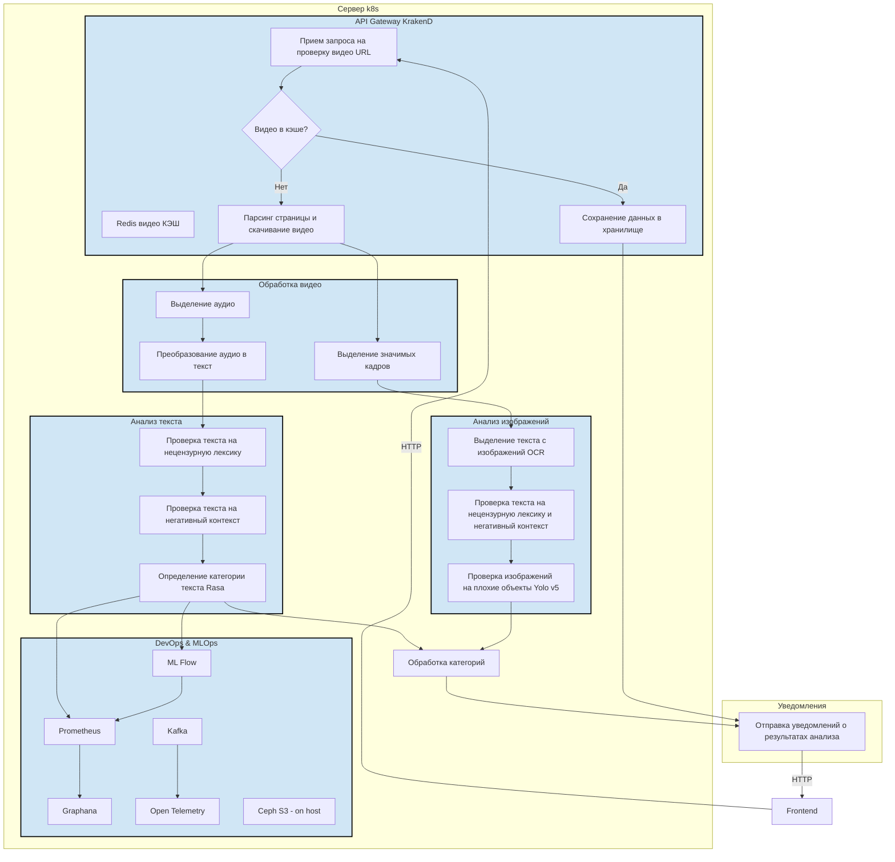

# Решение фильтрации и классификации видео-роликов для детей

```mermaid
flowchart TD
    subgraph Server[Сервер k8s]
        direction TB

        subgraph AGW[API Gateway KrakenD]
            direction TB
            AGWVC[Redis видео КЭШ]
            A1[Прием запроса на проверку видео URL]
            A2{Видео в кэше?}
            A3[Парсинг страницы и скачивание видео]
            A4[Сохранение данных в хранилище]
        end

        subgraph VideoProcessing[Обработка видео]
            direction TB
            B1[Выделение аудио]
            B2[Выделение значимых кадров]
            B3[Преобразование аудио в текст]
        end

        subgraph TextAnalysis[Анализ текста]
            direction TB
            C1[Проверка текста на нецензурную лексику]
            C2[Проверка текста на негативный контекст]
            C3[Определение категории текста Rasa]
        end

        subgraph ImageAnalysis[Анализ изображений]
            direction TB
            D1[Выделение текста с изображений OCR]
            D2[Проверка текста на нецензурную лексику и негативный контекст]
            D3[Проверка изображений на плохие объекты Yolo v5]
        end

        subgraph Ops[DevOps & MLOps]
            direction TB
            P1[Prometheus]
            G1[Graphana]
            MLF[ML Flow]
            OT[Open Telemetry]
            Kafka
            s3[Ceph S3 - on host]
        end

        Acolision[Обработка категорий]
    end


    subgraph Notification[Уведомления]
        direction TB
        E1[Отправка уведомлений о результатах анализа]
    end


    Frontend -->|HTTP| A1
    A1 --> A2
    A2 -->|Да| A4
    A2 -->|Нет| A3
    A3 --> B1 & B2
    B1 --> B3
    B2 --> D1
    B3 --> C1
    C1 --> C2
    C2 --> C3
    D1 --> D2
    D2 --> D3
    C3 --> Acolision
    D3 --> Acolision
    Acolision --> E1
    A4 --> E1
    C3 --> P1
    P1 --> G1
    MLF --> P1
    C3 --> MLF
    Kafka --> OT
    E1 -->|HTTP| Frontend

    style AGW fill:#D0E6F5,stroke:#000,stroke-width:2px
    style Ops fill:#D0E6F5,stroke:#000,stroke-width:2px
    style ImageAnalysis fill:#D0E6F5,stroke:#000,stroke-width:2px
    style TextAnalysis fill:#D0E6F5,stroke:#000,stroke-width:2px
    style VideoProcessing fill:#D0E6F5,stroke:#000,stroke-width:2px
```