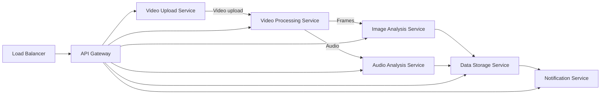
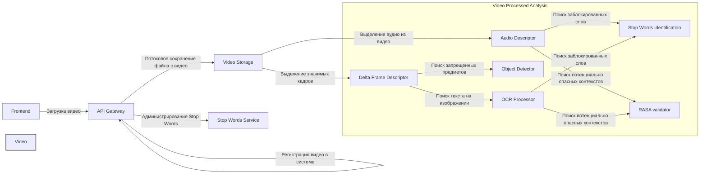
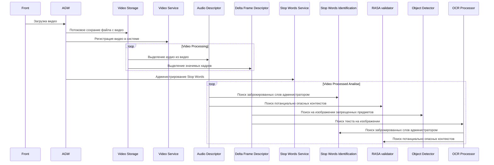

# Video Processing Docks

## Общие сведения и согласование интерфейсов

### Описание

Для простоты реализации видеохостинг был реализован на базе Laravel с использованием Livewire. Настройка категорий которые ребенку можно смотреть (_Согласовано на I созвоне_)

### Стек технологий

### System design





### Жизненный цикл обработки видео



## App

React Native кроссплатформинное приложение которое которое внутри имеет WebBrowser Component

## Frontend

<procedure title="Как запустить Frontend?" id="instanse-front">
    <step>
        <p>Start typing <code>procedure</code> and select a procedure type from the completion suggestions:</p>
        
    </step>
    <step>
        <p>Press <shortcut>Tab</shortcut> or <shortcut>Enter</shortcut> to insert the markup.</p>
    </step>
</procedure>

## Backend

<procedure title="Как запустить Backend?" id="instanse-back">
    <step>
        <p>Start typing <code>procedure</code> and select a procedure type from the completion suggestions:</p>
        
    </step>
    <step>
        <p>Press <shortcut>Tab</shortcut> or <shortcut>Enter</shortcut> to insert the markup.</p>
    </step>
</procedure>

### API

## ML

- Open source и Отчечественные решения
- Анализ комментариев к видео-роликам

### Video

#### Предложения:

- Clips Image (Image2Text)
- LLaVA (Image2Text)
- GPT-3.5 / LLaMA 3 7b: Поиск рекламного подтекста в аудио

Поиск объектов:

- Yolo

Ультимативное:
- Использование OpenAI API GPT-3.5 / Image Encoder

### Audio


# Research

[habr О защите детей от опасной информации](https://habr.com/ru/articles/208510/) - `ИСПОЛЬЗОВАТЬ ДЛЯ ПРЕЗЫ`

> **Пропаганда.** Информация, поощряющая или рекламирующая детям всевозможные социально неоднозначные действия – урон здоровью или самоубийства, употребление алкоголя, табака и прочих наркотических веществ, азартные игры, проституцию, попрошайничество, насилие к людям и животным, неуважение к семье и нетрадиционные сексуальные отношения, правонарушения.
Нецензурная брань и другие бранные выражения.
**Порнографическая информация и половые отношения в виде изображения или описания.**
**Насилие и пугающий контент.** Непосредственно изображение или описание (не реклама) насилия, правонарушений, жестокости, заболевания, самоубийства, несчастного случая, аварии или катастрофы и (или) их последствий;
**Персональная информация о ребенке**, (в законе — пострадавшем от правонарушения), которая позволяет установить его личность и местонахождение

## Формирование датасета

Для каждого из этих пунктов требуется сформировать датасет `Text` и `Image`:

- `Ницензурная брань` и `маты` на различных языках
- Призыв к: Суициду, Личная встреча, Педофилии, Расскрытие личной информации о ребенке (зрителе)
- `Скримеры` (определяются алгоритмически путем поиска сильного контраста видео вместе с характерным скачком громкости)
- Различные формы слова `Алкоголь` и его профизводные, также компании
- Различные формы слова `наркотики` и его профизводные, также компании
- Различные формы слова `расизм` и его профизводные, также компании
- Различные формы слова `религия` и его профизводные, также компании
- Различные формы слова `оружие` и его профизводные, также компании
- Различные формы слова `Йога` и его профизводные, также компании
- Различные формы слова `VTuber` и его профизводные, также компании
- Различные формы слова `Армия`, `Война` и его профизводные, также компании
- Различные формы слова `Порно`, `Разврат` и его профизводные, также компании
- Различные формы слова `Сигареты`, `Курение` и его профизводные, также компании


## Решение конкурентов

[Источник](https://www.kaspersky.ru/blog/safe-search-in-youtube/28721/?ysclid=lw849blzmh876209258)

Kaspersky Safe Kids и функция «Безопасный поиск в YouTube»

Чтобы ваши дети смотрели YouTube с пользой, мы дополнили наше решение Kaspersky Safe Kids функцией «Безопасный поиск в YouTube». Она есть и в платной, и в бесплатной версии Kaspersky Safe Kids. Эта функция автоматически контролирует, что ребенок ищет на YouTube в браузере (в Windows, Android и iOS) или в приложении для Android.

Если запрос относится к одной из шести запрещенных категорий — алкоголь, табак, наркотики, ругательства, расизм или видео для взрослых, — `вместо роликов ребенок увидит заглушку с предупреждением, что тема поиска небезопасная`.

Платная версия Kaspersky Safe Kids может присылать вам уведомления, если ребенок искал на YouTube что-то сомнительное. Кроме того, вы сможете проверить историю его запросов в видеосервисе, так что не придется стоять у него над душой, чтобы знать, чем он интересуется.

[https://tproger.ru/news/content-safety-api-released](https://tproger.ru/news/content-safety-api-released)

[Источник](https://github.com/finnbear/moderation?tab=readme-ov-file)

Accuracy was evaluated based on the first 100,000 items from this [dataset of moderated comments](https://raw.githubusercontent.com/vzhou842/profanity-check/master/profanity_check/data/clean_data.csv).

|**Package**|**Time**|**Accuracy**|**Comment**|
|:-----:|:-----:|:-----:|:-----:|
|[finnbear/moderation](https://github.com/finnbear/moderation)|1.63s|92.21%|Not stable, nor actively maintained|
|[TwinProduction/go-away](https://github.com/TwinProduction/go-away)|2.16s|82.18%|Many false positives from combined words like "push it"|

[Источник](https://github.com/dimitrismistriotis/alt-profanity-check)

This table speaks for itself:

| Package          | Test Accuracy | Balanced Test Accuracy | Precision | Recall | F1 Score |
| ---------------- | ------------- | ---------------------- | --------- | ------ | -------- |
| profanity-check  | 95.0%         | 93.0%                  | 86.1%     | 89.6%  | 0.88     |
| profanity-filter | 91.8%         | 83.6%                  | 85.4%     | 70.2%  | 0.77     |
| profanity        | 85.6%         | 65.1%                  | 91.7%     | 30.8%  | 0.46     |

See the How section below for more details on the dataset used for these results.


## Альтернативные решения

1. Библиотека для поиска в английском языке adult content - [https://github.com/vzhou842/profanity-check](https://github.com/vzhou842/profanity-check)

```Python
from profanity_check import predict, predict_prob

predict(['predict() takes an array and returns a 1 for each string if it is offensive, else 0.'])
# [0]

predict(['fuck you'])
# [1]

predict_prob(['predict_prob() takes an array and returns the probability each string is offensive'])
# [0.08686173]

predict_prob(['go to hell, you scum'])
# [0.7618861]
```

2. Full list of bad words and top swear words banned by Google NPM - [https://github.com/coffee-and-fun/google-profanity-words](https://github.com/coffee-and-fun/google-profanity-words)

3. Content Moderation Datasets - [https://github.com/fcakyon/content-moderation-deep-learning](https://github.com/fcakyon/content-moderation-deep-learning)

| name | paper | year | url | input modality | task | labels |
|--- |--- |--- |--- |--- |--- |--- |
| LSPD | [pdf](https://inass.org/wp-content/uploads/2021/09/2022022819-4.pdf) | 2022 | [page](https://sites.google.com/uit.edu.vn/LSPD) | image, video | image/video classification, instance segmentation | porn, normal, sexy, hentai, drawings, female/male genital, female breast, anus |
| MM-Trailer | [pdf](https://aclanthology.org/2021.ranlp-1.146.pdf) | 2021 | [page](https://ritual.uh.edu/RANLP2021/) | video | video classification | age rating |
| Movienet | [scholar](https://scholar.google.com/scholar?cluster=7273702520677604457&hl=en&as_sdt=0,5) | 2021 | [page](https://movienet.github.io/) | image, video, text | object detection, video classification | scene level actions and places, character bboxes |
| Movie script severity dataset | [pdf](https://arxiv.org/pdf/2109.09276.pdf) | 2021 | [github](https://github.com/RiTUAL-UH/Predicting-Severity-in-Movie-Scripts) | text | text classification | frightening, mild, moderate, severe |
| LVU | [pdf](https://chaoyuan.org/papers/lvu.pdf) | 2021 | [page](https://chaoyuan.org/lvu/) | video | video classification | relationship, place, like ration, view count, genre, writer, year per movie scene |
| Violence detection dataset | [scholar](https://scholar.google.com/scholar?cluster=839991967738597651&hl=en&as_sdt=0,5) | 2020 | [github](https://github.com/airtlab/A-Dataset-for-Automatic-Violence-Detection-in-Videos) | video | video classification | violent, not-violent |
| Movie script dataset | [pdf](https://sail.usc.edu/~mica/pubs/martinez2019violence.pdf) | 2019 | [github](https://github.com/usc-sail/mica-violence-ratings) | text | text classification | violent or not |
| Nudenet | [github](https://github.com/notAI-tech/NudeNet) | 2019 | [archive.org](https://archive.org/details/NudeNet_classifier_dataset_v1) | image | image classification | nude or not |
| Adult content dataset | [pdf](https://arxiv.org/abs/1612.09506) | 2017 | [contact](https://drive.google.com/file/d/1MrzzFxQ9t56i9d3gMAI3SaHXfVd1UUDt/view) | image | image classification | nude or not |
| Substance use dataset | [pdf](https://web.cs.ucdavis.edu/~hpirsiav/papers/substance_ictai17.pdf) | 2017 | [first author](https://www.linkedin.com/in/roy-arpita/) | image | image classification | drug related or not |
| NDPI2k dataset | [pdf](https://www.researchgate.net/profile/Sandra-Avila-5/publication/308398120_Pornography_Classification_The_Hidden_Clues_in_Video_Space-Time/links/5a205361a6fdcccd30e00d4a/Pornography-Classification-The-Hidden-Clues-in-Video-Space-Time.pdf) | 2016 | [contact](https://www.ic.unicamp.br/~rocha/mail/index.html) | video | video classification | porn or not |
| Violent Scenes Dataset | [springer](https://link.springer.com/article/10.1007/s11042-014-1984-4) | 2014 | [page](https://www.interdigital.com/data_sets/violent-scenes-dataset) | video | video classification | blood, fire, gun, gore, fight |
| VSD2014 | [pdf](http://www.cp.jku.at/people/schedl/Research/Publications/pdf/schedl_cbmi_2015.pdf) | 2014 | [download](http://www.cp.jku.at/datasets/VSD2014/VSD2014.zip) | video | video classification | blood, fire, gun, gore, fight |
| AIIA-PID4 | [pdf](https://www.igi-global.com/gateway/article/full-text-pdf/79140&riu=true) | 2013 | - | image | image classification | bikini, porn, skin, non-skin |
| NDPI800 dataset | [scholar](https://scholar.google.com/scholar?cluster=7836593192753784698&hl=en&as_sdt=0,5) | 2013 | [page](https://sites.google.com/site/pornographydatabase/) | video | video classification | porn or not |
| HMDB-51 | [scholar](https://scholar.google.com/scholar?cluster=5533751878557083824&hl=en&as_sdt=0,5) | 2011 | [page](https://serre-lab.clps.brown.edu/resource/hmdb-a-large-human-motion-database/#overview) | video |video classification | smoke, drink |

4. Unhook - плагин который позволяет убирать отображение на Youtube в DOM-дереве различных UIs
5. Py WEB Broswer class - [https://pypi.org/project/webbot/](https://pypi.org/project/webbot/)
6. Selenium Parcing - [https://habr.com/ru/companies/selectel/articles/754674/](https://habr.com/ru/companies/selectel/articles/754674/)
7. Py Library и REST API - [https://github.com/rominf/profanity-filter](https://github.com/rominf/profanity-filter)
8. Py Library для закраски и определения ницензурной брани на Англ - [https://github.com/areebbeigh/profanityfilter](https://github.com/areebbeigh/profanityfilter)
9. JS/TS Library для добавления слов в категории и поиск их в тексте после инициализации - [https://github.com/raymondjavaxx/swearjar-node](https://github.com/raymondjavaxx/swearjar-node)
10. Очень функциональная Py Library для закраски и поиска ницензурной лексики на английском с различными пробелами и символами - [https://github.com/finnbear/rustrict](https://github.com/finnbear/rustrict) = **ИСПОЛЬЗОВАТЬ ДЛЯ КОММЕНТАРИЕВ**
11. Py Library **RUSSIAN** закраска и поиск матов - [https://pypi.org/project/profanity-filter/](https://pypi.org/project/profanity-filter/)
12. Py Library **RUSSIAN** закраска и поиск матов - [https://github.com/bbd03/check-swear](https://github.com/bbd03/check-swear) = **НАЧАТЬ С ЭТОЙ БИБЛИОТЕКИ В ПЕРВУЮ ОЧЕРЕДЬ**
13. Гибкиц и функциональный Github Actions фильтр ницензурной брани с обработкой исключений - [https://github.com/IEvangelist/profanity-filter](https://github.com/IEvangelist/profanity-filter)
14. monkeyplug is a little script to mute profanity in audio files - [https://github.com/mmguero/monkeyplug](https://github.com/mmguero/monkeyplug)
15. JS/TS A filter of swear words - [https://github.com/rodgeraraujo/profanity](https://github.com/rodgeraraujo/profanity)
16. NSFW content filter - [https://github.com/Senor101/Project_Nfilter](https://github.com/Senor101/Project_Nfilter)
17. Sexual content filter REST API - [https://github.com/ds-oliveira/sexual_content_classification_api](https://github.com/ds-oliveira/sexual_content_classification_api)
18. PORN SITES URLs - [https://medium.com/syncedreview/huge-new-nsfw-dataset-for-content-filtering-c8e6a323d67c](https://medium.com/syncedreview/huge-new-nsfw-dataset-for-content-filtering-c8e6a323d67c)
19. PORN Yolo Image Classification - [https://github.com/algernonx/SexyYolo](https://github.com/algernonx/SexyYolo)

20. Модель поиска тепловых точек `Обноженных тел` - [https://www.researchgate.net/publication/347889516_Transfer_Detection_of_YOLO_to_Focus_CNN's_Attention_on_Nude_Regions_for_Adult_Content_Detection](https://www.researchgate.net/publication/347889516_Transfer_Detection_of_YOLO_to_Focus_CNN's_Attention_on_Nude_Regions_for_Adult_Content_Detection)
21. Basic Object Detection and Classification using Yolo v4 - [https://github.com/meerkatai/Yolo-v4-Object-Detection-Classification](https://github.com/meerkatai/Yolo-v4-Object-Detection-Classification)
22. Anime Porno and Kiss and also  Image classification - [https://github.com/deepanshu-yadav/NSFW-Classifier?tab=readme-ov-file](https://github.com/deepanshu-yadav/NSFW-Classifier?tab=readme-ov-file)
23. Anime легкая обноженка кадры и натуральные - [https://github.com/alex000kim/nsfw_data_scraper/tree/main](https://github.com/alex000kim/nsfw_data_scraper/tree/main) = **Часть изображений в датасете удалены**
24. Anime NSFW GIFs - [https://imgur.com/gallery/everything-anime-related-on-phone-im-not-sure-if-nsfw-0Frix](https://imgur.com/gallery/everything-anime-related-on-phone-im-not-sure-if-nsfw-0Frix) (on a Car Image - [https://imgur.com/gallery/you-know-you-like-anime-when-nsfw-sorta-7r6yLB7](https://imgur.com/gallery/you-know-you-like-anime-when-nsfw-sorta-7r6yLB7))
25. Porn Image Classification - https://universe.roboflow.com/sixtine/nsfw-classification/dataset/1
26. Porno Image datasets: [https://universe.roboflow.com/dicks/dicks-2](https://universe.roboflow.com/dicks/dicks-2) and [https://universe.roboflow.com/lol-c3obe/lol-cutting](https://universe.roboflow.com/lol-c3obe/lol-cutting) and [https://universe.roboflow.com/drugdetection/drug-ft4mu](https://universe.roboflow.com/drugdetection/drug-ft4mu) and [https://universe.roboflow.com/dicks/dicks-u8asd](https://universe.roboflow.com/dicks/dicks-u8asd) and [https://universe.roboflow.com/dicks/dicks-2](https://universe.roboflow.com/dicks/dicks-2) and [https://universe.roboflow.com/blurr/vagine](https://universe.roboflow.com/blurr/vagine) and ([https://universe.roboflow.com/wakker-6xfsn/nsfw-puss](https://universe.roboflow.com/wakker-6xfsn/nsfw-puss))
27. A LOT OF ANIME PORNO VIDEOS - [https://www.hentaicity.com/](https://www.hentaicity.com/) = **для ПАРСИНГА нужен VPN** (also [https://www.xvideos.com/tags/anime-porn](https://www.xvideos.com/tags/anime-porn) and [https://www.cartoonpornvideos.com/source/aniporn](https://www.cartoonpornvideos.com/source/aniporn))
28. Solder Images - [https://universe.roboflow.com/thalvane/solider](https://universe.roboflow.com/thalvane/solider)
28. Камеди клаб и видосики (**ТРЕБОВАНИЕ**)


# A curated list of tools and resources for online adult content/porn filtering, and accountability.

For children, families, and adults.

### Safe browsers:
- [SPIN Safe Browser](https://useboomerang.com/spin/)  |  [Manage SPIN](https://nationaledtech.com/portfolio/manage-spin-safe-browser/)

### Mobile blockers:
- [BlockSite](https://play.google.com/store/apps/details?id=co.blocksite)
- [DETOXIFY](https://play.google.com/store/apps/details?id=com.familyfirsttechnology.pornblocker)
- [Safashield (iOS)](https://www.safashield.com/)

### Parental control:
- [Boomerang](https://useboomerang.com/)
- [Kaspersky Safe Kids](https://kids.kaspersky.com/safe-kids/)
- [Mobicip](https://www.mobicip.com/)
- [Windows 10 and Xbox content restrictions](https://support.microsoft.com/en-us/help/12439/microsoft-account-set-content-restrictions-on-windows-10-and-xbox-one)
  #### International
    - [О! Safe Kids](https://play.google.com/store/apps/details?id=kg.nurtelecom.safekids) (Central Asia)

### Browser extensions:
- [FoxFilter](https://www.foxfilter.com/)
- [JSGuardian Web Site Filter](https://github.com/serv-inc/JSGuardian)

### DNS filters (public):
- [AdGuard DNS Family protection](https://adguard.com/adguard-dns/overview.html)
- [CleanBrowsing (for parents/kids/families)](https://cleanbrowsing.org/filters/)
- [CleanBrowsing (for adults)](https://cleanbrowsing.org/filters/)
- [Cloudflare DNS for Families](https://developers.cloudflare.com/1.1.1.1/setup/#1111-for-families) (resolver: `1.1.1.3`)
- [FoxDNS](https://www.s3blog.org/fox-web-security/secure-dns.html)
- [OpenDNS FamilyShield](https://www.opendns.com/setupguide/#familyshield)
- [Yandex DNS (Family)](https://dns.yandex.com/#modes-group)

  ### DNS changer apps
    - [Blokada](https://blokada.org/#download)
    - [Surfshark Trust DNS](https://surfshark.com/trust-dns)
      #### Android
        - [Intra (by Jigsaw, a Google project)](https://play.google.com/store/apps/details?id=app.intra)
        - [Lilly](https://play.google.com/store/apps/details?id=com.aykutcevik.dnschanger)
      #### iOS
        - [DNSCloak](https://apps.apple.com/us/app/dnscloak-secure-dns-client/id1452162351)
        - [Encrypted DNS profiles](https://github.com/paulmillr/encrypted-dns) (Advanced)

### Accountability:
- [Lion Accountability Browser](https://lionbrowser.app)
- [Accountable2you](https://accountable2you.com/)
- [CovenantEyes](https://www.covenanteyes.com/)
- [EverAccountable](https://everaccountable.com)
- [LeadMeNot](https://www.leadmenot.org)
- [RealMenDontPorn](https://play.google.com/store/apps/details?id=net.truonghieu.rmdp)
- [Truple](https://truple.io/)
- [Trustablee](https://play.google.com/store/apps/details?id=com.androidapp.watchme)